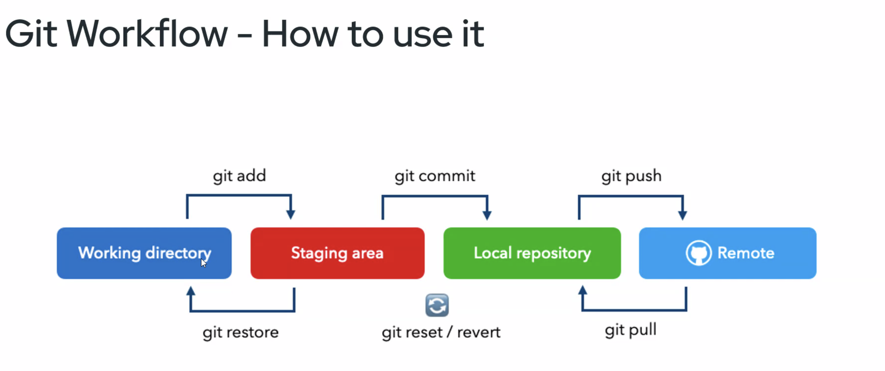

# Git Basic Workflow for a complete beginner

Git is one of the Source Code Management (SCM) atau Version Control System (VCS) tool, created by the creator of Linux, Linus Torvalds. It's also free and open source. 

There are alternatives to Git, like Subversion, CVS, Perforece, and ClearCase but Git is probably the most used VCS out there.


## Initializing

Create a working directory
```shell
mkdir repo-name
```

Move into the working directory
```shell
cd repo-name
```

Initialize a git repository inside the working directory
```shell
git init
```

You're ready to go! a new `.git` directory will be created inside the working directory, which holds all Git metadata, including the `index` and `HEAD` tree.

The working directory you created is now a Git Repository! since it's in your local machine, it's called local repository, in the opposite of something called remote repository.
## Make some changes
Create some changes to your local repository, like adding a new file:
```shell
touch Readme.md
```

And then, check your repository status:
```shell
git status
```

`git status` will show something like this:
```shell
On branch master

No commits yet

Untracked files:
  (use "git add <file>..." to include in what will be committed)
        Readme.md

nothing added to commit but untracked files present (use "git add" to track)
```

Telling you that there's no changes committed yet, and there's one untracked file, which is the  `Readme.md` (the file you've just made).

To commit the change you made, you first need to select the change you want to commit to the repository, this process called "Tracking", which is done by executing `git add <files>`.

Since the only changes we made to the repository is creating `Readme.md`, let's track it!

```shell
git add Readme.md
```

Running `git status` again, will show you something like this:
```shell
On branch master

No commits yet

Changes to be committed:
  (use "git rm --cached <file>..." to unstage)
        new file:   Readme.md
```

It tells you that there's one change ready to be committed, which is adding a new file: `Readme.md`. 
At this point, if you want to apply the changes to the repository (or, committing the change), you can go on with command `git commit`, or if you want to cancel the changes (or, unstage the changes), you can go with either `git reset`, or  `git restore`.

## Committing the changes

Let's commit the changes! run `git commit`,  you'll need to pass a message to the commit, to describe the changes you made in this commit. Remember, a commit is like an object in the repository history, so you'll need to describe each object so you can tell what each commit changed.

```shell
git commit -m "add empty Readme.md"
```

This will be the first item in the repository history, hit `git log` to view the history list, it'll look like this:

```shell
commit 076734a5b995588f709f063961b3654ac081bbf8 (HEAD -> master)
Author: rkspx <kosiriki@gmail.com>
Date:   Thu Oct 17 20:08:53 2024 +0700

    add empty Readme.md
```

Without proper message, you can imagine how chaotic your history would look like! Also, at some point, you'll need to go back and undo some changes you made, and these commit messages will help you on choosing the right point you want to undo your repository to.

Running `git commit` will turn all the tracked changes you made into a commit history, it can't be picked and choose, so be careful on changes you tracked using `git add`.

## Cancelling changes
Let's made another change, by adding some content to the `Readme.md`.

```shell
echo "# Read Me\!" > Readme.md
```

This will add a header into the `Readme.md` file. Running `git status` will tell you there's a change, but it's not tracked yet, and can not be committed.

```shell
On branch master
Changes not staged for commit:
  (use "git add <file>..." to update what will be committed)
  (use "git restore <file>..." to discard changes in working directory)
        modified:   Readme.md

no changes added to commit (use "git add" and/or "git commit -a")
```

Let's say you tracked the changes, by running `git add Readme.md`, and then running `git status` will show this:
```shell
On branch master
Changes to be committed:
  (use "git restore --staged <file>..." to unstage)
        modified:   Readme.md
```

but, on second thought, you realized the change you made was a mistake, and you don't want the change to be included on your next commit, you can 'unstage' the change using one of these way:
- `git restore`
- `git reset`

let's try `git restore` first, since it's what the `git status` recommends. Run `git restore --staged Readme.md`, and `git status` will tell the same status as when you haven't done the `git add`:

```shell
On branch master
Changes not staged for commit:
  (use "git add <file>..." to update what will be committed)
  (use "git restore <file>..." to discard changes in working directory)
        modified:   Readme.md

no changes added to commit (use "git add" and/or "git commit -a")
```

Be careful not to run `git restore Readme.md` again, since it'll delete the change you made permanently! And you can't undo it. Just like the command name, it'll restore the `Readme.md` to the condition before the change made.

You can also use `git reset HEAD <file>` to do the same thing, it works differently under the hood, and on some advanced use-case you might prefer one to another. 

Let's make the change again
```shell
echo "# Read Me\!" > Readme.md
```

and track it
```shell
git add Readme.md
```

and `git status` shows it ready to be committed.
```shell
On branch master
Changes to be committed:
  (use "git restore --staged <file>..." to unstage)
        modified:   Readme.md
```

Cancel the change using `git reset HEAD Readme.md`, and the `git status` will show the change you made to the `Readme.md` file is unstaged, and will not be included if you run `git commit`

```shell
On branch master
Changes not staged for commit:
  (use "git add <file>..." to update what will be committed)
  (use "git restore <file>..." to discard changes in working directory)
        modified:   Readme.md

no changes added to commit (use "git add" and/or "git commit -a")
```

But that's just untracking some changes before they get committed, what if you carelessly committed some unwanted changes?
## Undoing a commit
Let's say instead of tracking one file, you track every changes in the current directory using `git add .` and committed them into the repository, how do you go back and remove some changes from the commit. You can use `git reset` for this, let's demonstrate it!

First, make some changes

```shell
echo "# Oops, this shouldn\'t happen\!" > Readme.md
echo "foo" > foo.txt
```

and then track the changes:
```shell
git add .
```

and commit it right away!
```shell
git commit -m "add foo.txt"
```

and the `git log` shows you added `foo.txt` into the repository, but mistakenly add changes to the `Readme.md` as well:
```shell
commit 0a81ff1076ddff27d0a5b89328d4f6623e0de2ed (HEAD -> master)
Author: rkspx <kosiriki@gmail.com>
Date:   Thu Oct 17 21:10:23 2024 +0700

    add foo.txt

commit 076734a5b995588f709f063961b3654ac081bbf8
Author: rkspx <kosiriki@gmail.com>
Date:   Thu Oct 17 20:08:53 2024 +0700

    add empty Readme.md
```

let's undo it, by running `git reset`
```shell
git reset HEAD~
```

both `Readme.md` and `foo.txt` untracked and not staged
```shell
On branch master
Changes not staged for commit:
  (use "git add <file>..." to update what will be committed)
  (use "git restore <file>..." to discard changes in working directory)
        modified:   Readme.md

Untracked files:
  (use "git add <file>..." to include in what will be committed)
        foo.txt

no changes added to commit (use "git add" and/or "git commit -a")
```

at this point, make the correct changes, and commit it
```shell
git add foo.txt
git commit -m "add foo.txt"
```

`git log` will show the same history, and `git status` will tell you that the change to `Readme.md` isn't included into your latest commit, sweet!
```shell
$ git log
commit ddedc24a9c4d793dc862a314d0ad3a2d670cb693 (HEAD -> master)
Author: rkspx <kosiriki@gmail.com>
Date:   Thu Oct 17 21:13:45 2024 +0700

    add foo.txt

commit 076734a5b995588f709f063961b3654ac081bbf8
Author: rkspx <kosiriki@gmail.com>
Date:   Thu Oct 17 20:08:53 2024 +0700

    add empty Readme.md

$ git status
On branch master
Changes not staged for commit:
  (use "git add <file>..." to update what will be committed)
  (use "git restore <file>..." to discard changes in working directory)
        modified:   Readme.md

no changes added to commit (use "git add" and/or "git commit -a")
```

and you can just restore the `Readme.md` file if you want, which will turn the file back into an empty file.
```shell
git restore Readme.md
```

Note that since `git reset HEAD~` messes with the commit history, do this ONLY if the changes hasn't been pushed into a remote repository.

That's probably the most basic workflow you'll need to know about committing changes into Git Repository.